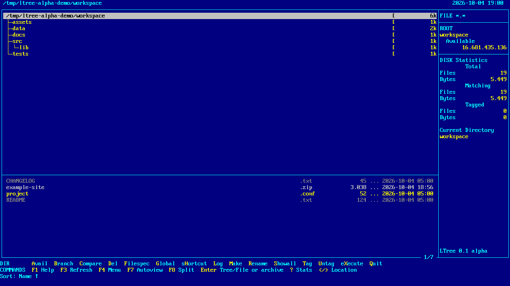
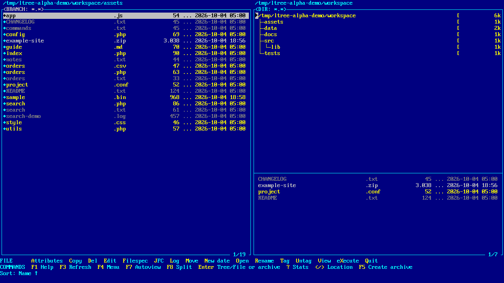
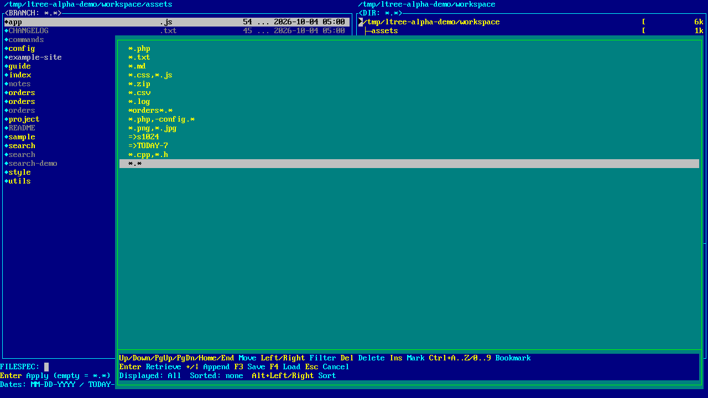
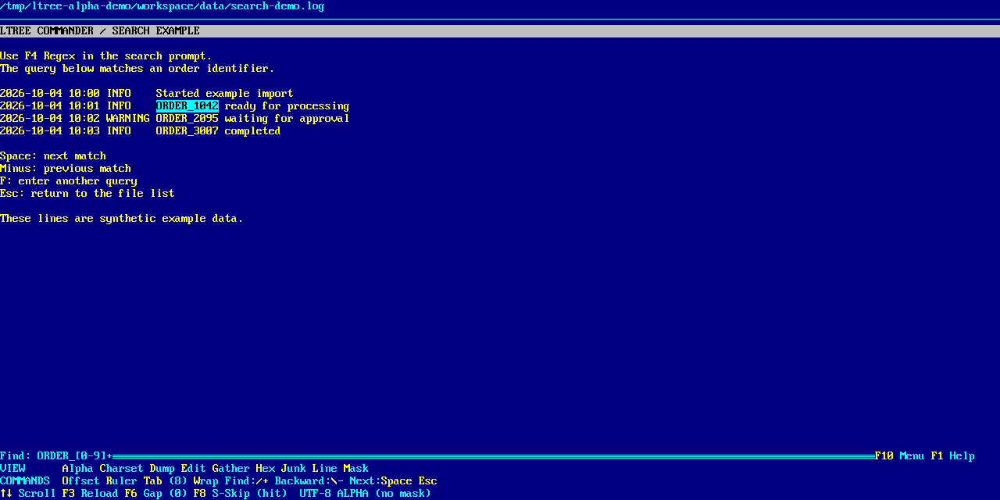
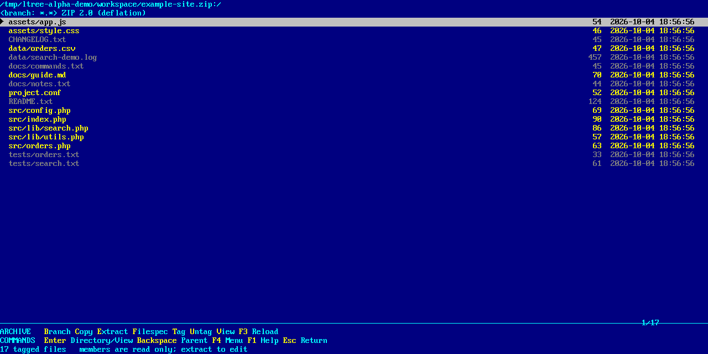
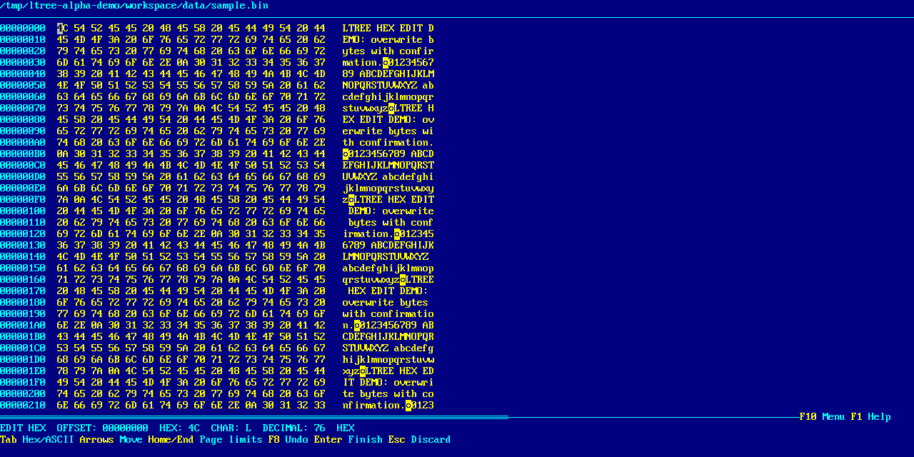
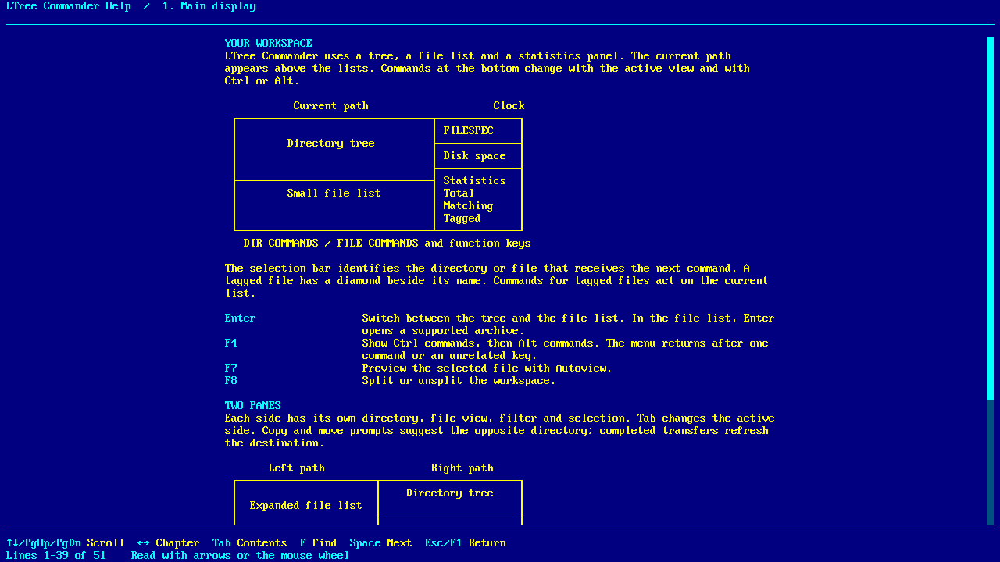

# LTree Commander

**A native Linux clone that aims to reproduce ZTreeWin / ZTreeBold as faithfully as possible.**

LTree Commander brings the tree-oriented, keyboard-driven workflow of **ZTreeWin and the ZTreeBold family by ZEDTEK, Inc.** to Linux: directory logging, Branch and Showall lists, file tagging, contextual command menus, persistent histories and a classic blue/cyan/yellow interface. **ZTreeWin 2.2.19 is the main behavioral reference for this alpha.**

The lineage matters: ZTree is itself an independently written recreation inspired by **XTree / XTreeGold for DOS**. ZEDTEK describes that history on its [official website](https://www.ztree.com/) and in its [FAQ](https://www.ztree.com/html/faq.htm). LTree Commander continues that workflow on Linux, adapting permissions, paths, symbolic links, mounted filesystems and desktop integration.

This is an independent implementation, with no affiliation with or endorsement by ZEDTEK or the owners of XTree. Original ZTree/XTree code, binaries, manuals, logos and user configuration are not included. Product names belong to their respective owners; the GNU GPL version 3 or later applies to LTree Commander's original work.

**Version: 0.1.0-alpha.1 · executable: `ltc` · license: [GPL-3.0-or-later](LICENSE).** This is a working alpha, with substantial features still to implement before full compatibility. See [alpha status](docs/ALPHA.md).

## Screenshots

All screenshots show LTree Commander itself with synthetic example files.

### Directory tree and file statistics



### Split panels and Branch file list



### Reusable Filespec history



### Regular expression search and viewer matches



### ZIP browsing



### Hex editing



### Navigable F1 manual



## What works in this alpha

- Directory trees, recursive branch logging, Branch/Showall/Global lists, file tags, Filespec filters and sorting.
- Two independent panels with **F8**, **F7 Autoview**, optional branch sizes and automatic destination refresh after transfers.
- Individual and tagged copy/move/delete/rename operations, filename masks and copy with directory structure.
- **Prune**, **Graft**, directory creation, symbolic links, POSIX permissions and access/modification timestamps.
- Text, Hex and Unicode searches, optional **regular expressions**, progress/spinner/hit count and persistent search/Filespec histories.
- A text/Hex viewer with search handoff from tagged files, **Space** for the next match, viewer commands and confirmed byte overwrite editing.
- Text/binary file comparison and directory/branch comparison.
- Archive browsing, member search, extraction and creation of **ZIP, TAR, TAR.GZ, TAR.BZ2, TAR.XZ and 7Z**; single-file **GZ, BZ2 and XZ** output.
- Integrated shell through **X**, external editor integration, contextual **F1** help, single-instance graphical activation and saved window size/state.
- A **terminal interface** with portable graphical commands, the classic appearance and modifier menus adapted to ncurses.

The graphical and terminal interfaces share filesystem engines. Terminal commands include transfers, deletion, attributes, timestamps, search, comparisons, archives, shell execution and an extended viewer. F4 and F10 menus expose commands whose modifier keys cannot be distinguished by a classic terminal. See [terminal usage](docs/TERMINAL.md). RAR support depends on libarchive and has not been fully tested. Archive members cannot yet be edited in place. The viewer currently loads at most **32 MiB**.

## Build

### Quick start: Arch Linux / CachyOS

The **graphical build requires Qt 6.11 or newer**. Debian 12 and 13 ship older Qt versions, so their standard Qt development packages are insufficient for that interface. **A terminal-only build requires no Qt SDK or Qt runtime.** See the [build and installation guide](docs/BUILD.md) for all dependencies, other distributions, font setup, tests and troubleshooting.

Install the build dependencies on an up-to-date Arch Linux / CachyOS system:

```bash
sudo pacman -Syu --needed gcc cmake ninja git qt6-base qtermwidget \
  libarchive python-fonttools kbd gzip pkgconf ncurses bash coreutils diffutils
```

Check Qt and the font tools, then build both graphical and terminal interfaces:

```bash
pkg-config --modversion Qt6Core
python3 -c "import fontTools; print(fontTools.__version__)"
test -r /usr/share/kbd/consolefonts/default8x16.psfu.gz

git clone https://github.com/dejotaerre/ltree-commander.git
cd ltree-commander
cmake -S . -B build -G Ninja -DCMAKE_BUILD_TYPE=Release -DBUILD_TESTING=OFF
cmake --build build -j 4
./build/ltc --version
./build/ltc "$HOME"
```

The executable is **`build/ltc`**. Try `./build/ltc --terminal "$HOME"` for the terminal interface. To install it for your user:

```bash
install -Dm755 build/ltc "$HOME/.local/bin/ltc"
export PATH="$HOME/.local/bin:$PATH"
ltc --version
```

The `export` applies to the current shell; keep `~/.local/bin` in your shell's `PATH` for later sessions. The [installation section](docs/BUILD.md#install-for-your-user) also covers the desktop launcher and icon.

### Terminal-only build: no Qt required

On Debian 12 / Ubuntu:

```bash
sudo apt install build-essential cmake ninja-build pkg-config \
  libarchive-dev libncurses-dev libicu-dev libpcre2-dev nlohmann-json3-dev
cmake -S . -B build-terminal -G Ninja \
  -DCMAKE_BUILD_TYPE=Release -DBUILD_TESTING=OFF -DLTREE_BUILD_GUI=OFF
cmake --build build-terminal -j 4
./build-terminal/ltc "$HOME"
```

This uses C++/POSIX, ICU for Unicode, PCRE2 for regular expressions, nlohmann JSON for histories, libarchive and ncursesw. It does not find, compile or link Qt or QTermWidget. The same file-operation engines and terminal commands are retained. See the [build guide](docs/BUILD.md#build-only-the-terminal-interface) for Arch packages and tests.

Tests are disabled in the quick starts. Enable them with `-DBUILD_TESTING=ON`; terminal tests additionally need Python 3, `zip` and `7z`. Graphical tests also need Qt Test. To omit ncurses from a graphical build, use `-DLTREE_BUILD_TERMINAL=OFF`.

## First steps

| Context | Keys | Action |
| --- | --- | --- |
| Tree | **\***, **B** | Log a branch and show its files |
| Tree / files | **Enter** | Switch between tree and files; open a recognized archive from files |
| Files | **Ctrl+T**, **Ctrl+S** | Tag the visible files and search their contents |
| Search prompt | **F4**, **F2** | Choose Text/Hex/Unicode/Regex; toggle case sensitivity |
| Files | **V**, **Space** | View a file and continue the search matches |
| Tree / files | **F**, **Up** | Enter a Filespec or retrieve its history |
| Files | **C / M / D / R / N** | Copy / move / delete / rename / change timestamps |
| Files | **Ctrl+key** | Apply supported commands to tagged files |
| Files | **Alt+C / Alt+M** | Copy / move tagged files with paths |
| Tree | **M / D / Alt+P / Alt+G** | Make directory / delete empty directory / Prune / Graft |
| Tree / files | **F7 / F8 / Tab** | Autoview / split panels / switch panel |
| Tree / files | **F4** | Select a Ctrl/Alt command menu for one command |
| Tree / files | **X / F1** | Open the shell / contextual manual |

The program's interface and prompts are in **English**. Desktop shortcuts remain under the desktop's control: archives open with **Enter**, preserving GNOME's Alt+F5 shortcut.

Deletion can be permanent. Review the confirmations and try destructive operations on disposable files while evaluating the alpha. Prune offers a trash option; ordinary Delete does not currently use trash. There is no global undo or recovery journal for interrupted batches.

## Documentation and development

- [Build and installation guide](docs/BUILD.md) — dependencies, distribution differences, tests and desktop setup.
- [Detailed usage guide](docs/USAGE.md) — Spanish, with command workflows and limitations.
- [Alpha status](docs/ALPHA.md) — release scope and validation.
- [Implementation notes](docs/IMPLEMENTACION.md) — Spanish, including incomplete features and design limits.
- [Viewer and archives](docs/VISOR_Y_COMPRIMIDOS.md) — Spanish, supported formats and protections.
- [Changelog](CHANGELOG.md).
- [Dependencies and third-party licenses](THIRD_PARTY.md).

Contributions and bug reports are welcome through [GitHub issues](https://github.com/dejotaerre/ltree-commander/issues). Include the version, graphical/terminal mode, desktop/session type and steps using example files. Full ZTree compatibility remains the goal; this alpha does not claim it has been achieved.

## License and acknowledgments

Copyright © 2026 **Hector De Armas (dejotaerre)**. LTree Commander's original code, documentation and project-created assets are available under the **[GNU General Public License, version 3 or later](LICENSE)** (`GPL-3.0-or-later`).

You may redistribute and modify this work under version 3 of the GNU General Public License, or any later version published by the Free Software Foundation. It is distributed without any warranty, including implied warranties of merchantability or fitness for a particular purpose. See [LICENSE](LICENSE) for the full terms.

Credit for the reference workflow and interface goes to **ZTreeWin / ZTreeBold by ZEDTEK, Inc.**, and to the earlier **XTree / XTreeGold for DOS**. Visit [ZTree's official site](https://www.ztree.com/) for the original product.

Dependencies retain their own licenses. In particular, QTermWidget is GPL-2.0-or-later: distributing a combined executable requires complying with its applicable GPL terms as well as the other dependency/font licenses. **This alpha release distributes project sources and screenshots, with no prebuilt binaries or font data.** The project license does not relicense those dependencies. Revisions previously published under MIT retain their original licensing terms.
